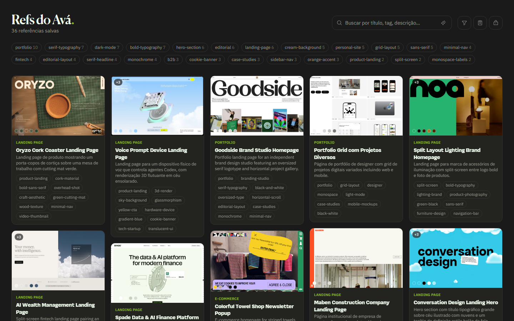

# Refs

My personal library of design references, tagged by AI and readable by my coding agent. **[refs.avaaraujo.com](https://refs.avaaraujo.com)**



## Why I built it

Pinterest and Are.na are good for browsing, but the things I save there don't help when I start a new project. With Refs, I paste a link and the rest is automatic. It takes screenshots of the page, and Claude writes the title, description, category, style, color and tags. The library works as a moodboard for me and as visual direction that Claude Code can query when it builds my other products.

## Design and product decisions

- **Saving takes one step.** Paste a link (or drop a screenshot), with an optional note. The structure is generated, not typed. A bookmarklet and a Chrome extension save the page you're on.
- **Structured for humans and agents.** Every generated field works both for search and as context an agent can read.
- **Search the way designers think.** Text and semantic search (Voyage embeddings), filters by tag, category and style, and a color picker that matches by proximity against the palette extracted from each screenshot.
- **Several screenshots per reference.** The hero, pricing and footer of the same site live together. References can belong to many collections at once.
- **An MCP server.** `/api/mcp` exposes read-only tools (`search_refs`, `get_item_brief`, `get_board_brief`, `list_collections`, `list_tags`), so Claude Code can pull references into any project.
- **Kept simple on purpose.** It's a single-user tool: the library is public to read, and only adding and organizing needs a login.

**Stack:** Next.js 16, React 19, Tailwind v4, Supabase (Postgres, Storage, Auth), Claude API, Voyage AI, sharp, Vercel.

**Built with AI.** I write the code with Claude Code as a pair. The design and product decisions are mine.

## Running locally

```bash
npm install
npm run dev
```

You need a Supabase project with the schema in `supabase/` and, in `.env.local`, the Supabase URL and keys, `ANTHROPIC_API_KEY` (tagging) and `SCREENSHOTONE_ACCESS_KEY` (screenshots from a URL). `VOYAGE_API_KEY` is optional: without it, search falls back to plain substring matching. The Chrome extension lives in `chrome-extension/` (see its README).
